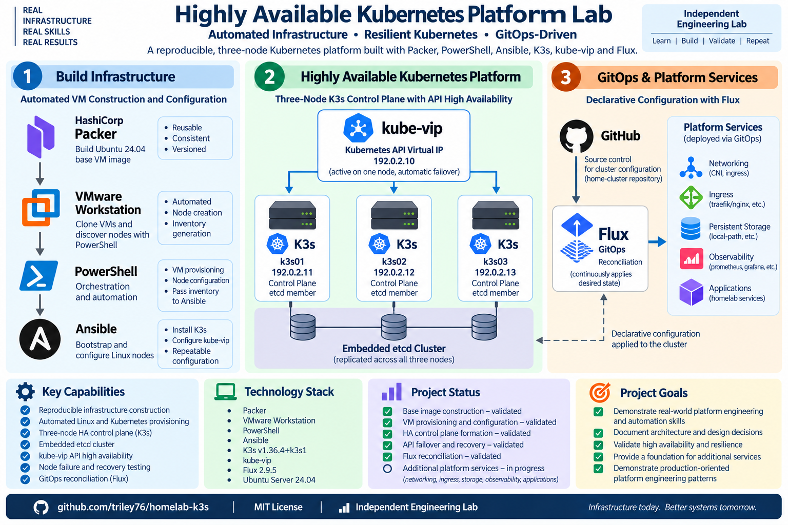

# Highly Available Kubernetes Platform Lab

A reproducible three-node Kubernetes platform built to demonstrate infrastructure automation, high availability, GitOps, and operational resilience.

The environment uses **Packer**, **PowerShell**, **Ansible**, **K3s**, **embedded etcd**, **kube-vip**, and **Flux** to automate the lifecycle from base virtual-machine construction through a highly available Kubernetes control plane and GitOps reconciliation.

> **Project status:** Core V2 cluster provisioning, three-node control-plane formation, API high availability, controlled node-failure recovery, and Flux reconciliation have been implemented and validated. Additional platform services are being introduced incrementally through GitOps.



## What This Demonstrates

- Reproducible infrastructure construction rather than manually configured servers
- Automated Linux and Kubernetes provisioning
- Three-node highly available K3s control plane with embedded etcd
- Kubernetes API failover through kube-vip
- Ordered control-plane formation and serial etcd member joins
- Runtime handling of cluster join credentials rather than committed secrets
- GitOps reconciliation using Flux
- Controlled node-failure and recovery testing
- Separation of infrastructure provisioning from Kubernetes platform configuration
- Architecture decisions and validation results documented alongside the code

## Architecture

```text
                         Git
                          |
                   Flux reconciliation
                          |
                          v
                  +---------------+
                  | home-cluster  |
                  | GitOps config |
                  +-------+-------+
                          |
                          v
              Kubernetes Platform Services

 Workstation
 +----------------------------------------------------------+
 |                                                          |
 |  Packer          PowerShell             Ansible          |
 |     |                 |                    |             |
 |     v                 v                    v             |
 | Base Ubuntu VM -> Clone/Discover -> Bootstrap/Configure  |
 |                                                          |
 +---------------------------+------------------------------+
                             |
                             v
                Kubernetes API VIP: 192.0.2.10
                         (kube-vip)
                             |
              +--------------+--------------+
              |              |              |
              v              v              v
          +--------+      +--------+      +--------+
          | k3s01  |      | k3s02  |      | k3s03  |
          | server |      | server |      | server |
          +--------+      +--------+      +--------+
          192.0.2.11      192.0.2.12      192.0.2.13
              \              |              /
               +-------------+-------------+
                             |
                      embedded etcd
```

The addresses above use the RFC 5737 documentation range and are examples rather than the addresses of the underlying lab environment.

## Validated Capabilities

| Capability | Status |
| --- | --- |
| Ubuntu base-image construction with Packer | Validated |
| Automated VM cloning and node discovery | Validated |
| Linux node bootstrap with Ansible | Validated |
| Three-node K3s control plane | Validated |
| Embedded-etcd cluster formation | Validated |
| kube-vip Kubernetes API VIP | Validated |
| Control-plane node failure and recovery | Validated |
| Flux Git source reconciliation | Validated |
| Flux Kustomization reconciliation | Validated |
| GitOps platform-service expansion | In progress |

The current Kubernetes baseline is pinned to **K3s v1.36.4+k3s1**. Flux **2.9.5** has been bootstrapped and validated against the V2 cluster.

## Failure and Recovery Validation

A controlled full-VM failure test was performed against the three-node control plane.

When the node owning the Kubernetes API VIP was powered off:

1. kube-vip moved the API VIP to a surviving control-plane node.
2. The remaining Kubernetes nodes stayed available.
3. Workloads were able to reschedule onto surviving capacity.
4. The powered-off node was restarted and automatically rejoined the cluster.
5. The API VIP remained on the surviving owner with a single active VIP owner observed.

This test validates the specific single-node failure scenario exercised in the lab. It is **not** presented as evidence of zero-downtime behavior or tolerance of every possible multi-node failure.

Detailed validation notes are available in [docs/validation.md](docs/validation.md).

## Reproducible Build Flow

The infrastructure workflow is intentionally layered:

```text
Packer
  |
  v
Ubuntu base VM
  |
  v
PowerShell clone/discovery
  |
  v
Ansible node bootstrap
  |
  v
K3s server initialization
  |
  v
kube-vip
  |
  v
Serial server joins
  |
  v
Three-node HA control plane
  |
  v
Flux GitOps reconciliation
```

One configuration module, [`nodes.py`](nodes.py), provides the authoritative cluster topology and shared network values consumed by the automation.

The Ansible orchestration initializes the first K3s server and then joins additional servers **serially**. This ordering was introduced after testing exposed an etcd learner issue during concurrent control-plane joins.

That behavior is documented as part of the platform design rather than hidden inside the automation.

## GitOps Boundary

This repository is responsible for **constructing the Kubernetes infrastructure**:

- VM image creation
- VM cloning and discovery
- operating-system configuration
- K3s installation
- embedded-etcd control-plane formation
- kube-vip deployment

Ongoing Kubernetes platform configuration is intentionally separated into a companion `home-cluster` GitOps repository reconciled by Flux.

This keeps infrastructure construction separate from the desired state of services running on the cluster.

The GitOps foundation has been validated. Networking services, ingress, persistent storage, observability, and application workloads are being introduced incrementally rather than represented here as already complete.

## Repository Structure

```text
.
├── ansible/                 Ansible orchestration and roles
├── config/                  Local workstation configuration template
├── docs/
│   ├── architecture.md      Detailed platform architecture
│   ├── build.md             Reproducible build procedure
│   ├── validation.md        Validation and failure-test evidence
│   └── decisions/           Architecture Decision Records
├── packer/                  VMware Ubuntu base-image definition
├── bootstrap_nodes.ps1      Bootstrap orchestration
├── clone_nodes.ps1          VMware node cloning
├── discover_nodes.ps1       Node discovery
├── generate_bootstrap_inventory.ps1
├── nodes.py                 Cluster configuration source of truth
└── README.md
```

## Design Decisions

Key architecture choices are documented as Architecture Decision Records:

- [ADR-001: K3s](docs/decisions/001-k3s.md)
- [ADR-002: Embedded etcd](docs/decisions/002-embedded-etcd.md)
- [ADR-003: kube-vip](docs/decisions/003-kube-vip.md)
- [ADR-004: Flux GitOps](docs/decisions/004-flux-gitops.md)

See [docs/architecture.md](docs/architecture.md) for the detailed architecture and [docs/build.md](docs/build.md) for the build workflow.

## Configuration and Secret Handling

Public examples use documentation addresses and placeholder credentials.

Environment-specific workstation settings are kept in an ignored local configuration file derived from:

```text
config/workstation.example.ps1
```

Packer autoinstall credentials are similarly derived locally from:

```text
packer/http/user-data.example
```

The resulting `packer/http/user-data` file is excluded from Git.

K3s join credentials are obtained at runtime during cluster construction and are not committed to the repository.

## Technology

| Area | Technology |
| --- | --- |
| Virtualization | VMware Workstation |
| Image construction | Packer |
| Workstation automation | PowerShell |
| Configuration management | Ansible |
| Operating system | Ubuntu Server 24.04 |
| Kubernetes distribution | K3s |
| Control-plane datastore | Embedded etcd |
| API high availability | kube-vip |
| GitOps | Flux |
| Configuration source | Python |
| Version control | Git / GitHub |

## Roadmap

The next platform layers are being introduced through GitOps:

- service load balancing
- ingress
- persistent storage
- observability
- representative application workloads

Each layer is intended to be introduced and validated independently rather than added as an untested collection of components.

## Scope

This is an **independent engineering lab and portfolio project**, not a production environment.

Its purpose is to exercise and document platform-engineering patterns including reproducible infrastructure, automation, high availability, failure recovery, GitOps, and architectural decision-making.

## License

This project is licensed under the [MIT License](LICENSE).
